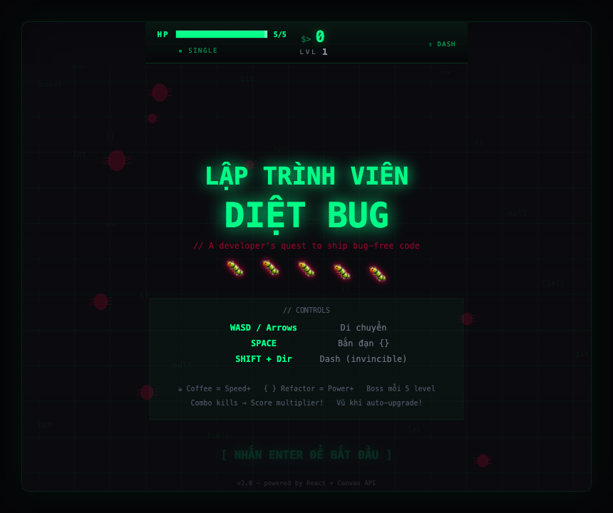
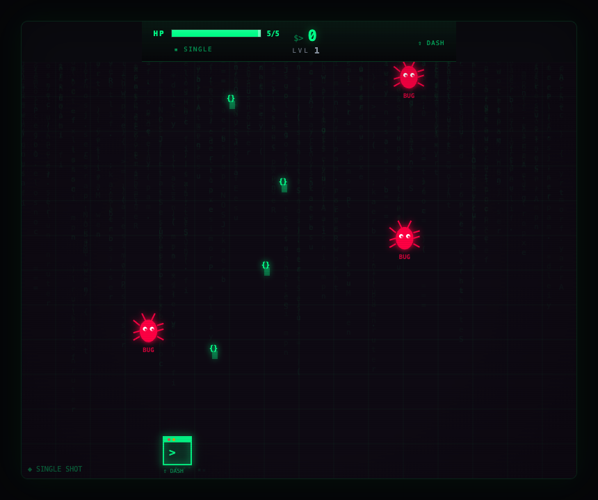
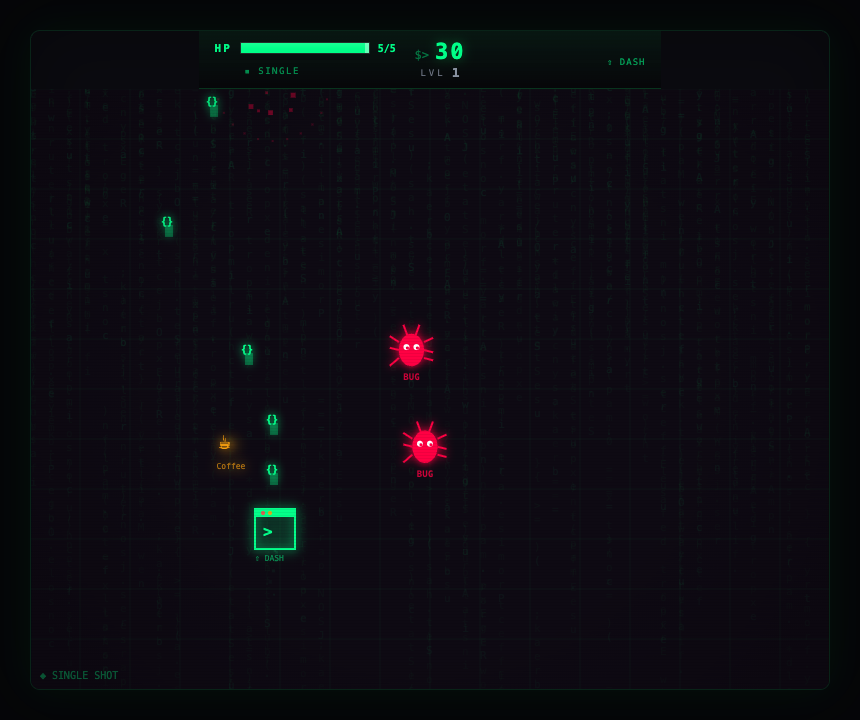
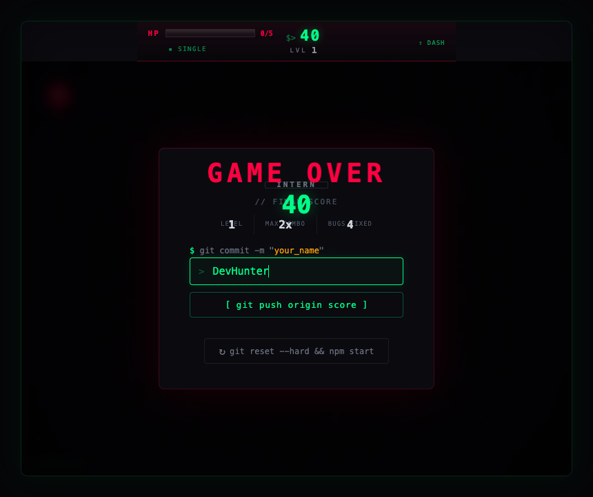
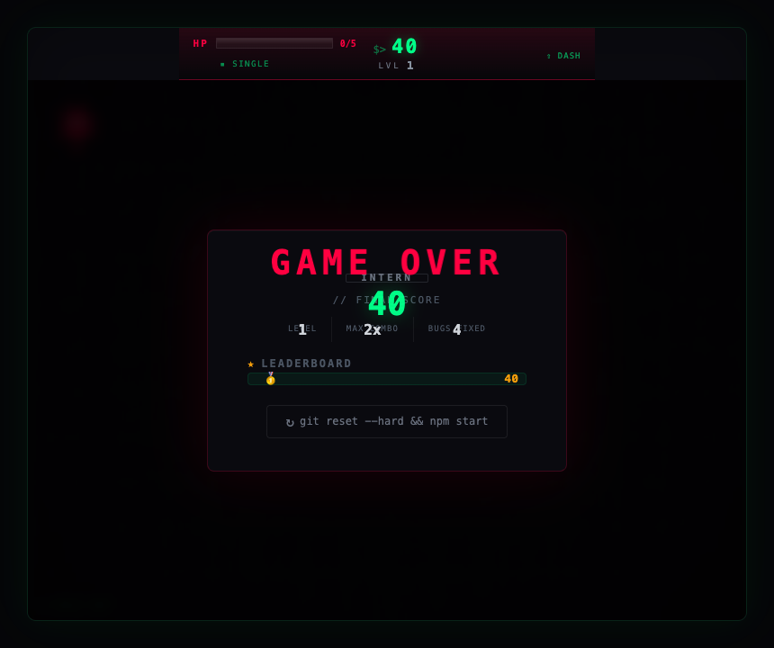

# Bug Shooter — Developer vs Bugs

A retro-styled arcade shoot 'em up game where you play as a **Terminal** fighting off an endless swarm of software **Bugs**. Built with **React** and the **Canvas API**.

Your mission: ship bug-free code. Your weapon: `JSON`.



---

## Table of Contents

- [Features](#features)
- [Screenshots](#screenshots)
- [Getting Started](#getting-started)
- [How to Play](#how-to-play)
- [Game Mechanics](#game-mechanics)
- [Project Structure](#project-structure)
- [Backend Integration](#backend-integration)
- [Tech Stack](#tech-stack)
- [License](#license)

---

## Features

- **Canvas-based rendering** at 60fps using `requestAnimationFrame`
- **3 enemy types**: Normal bugs, Zigzag bugs, and Splitter bugs (split into 2 mini-bugs on death)
- **Boss fights** every 5 levels — face off against Memory Leak, Null Pointer, Infinite Loop, and more
- **Combo system** with score multipliers (up to x5)
- **Weapon evolution**: Single → Double → Triple shot as you level up
- **Dash ability** with invincibility frames and afterimage trail
- **Power-ups**: Coffee (speed boost) and Refactor (power boost)
- **Sound effects** synthesized in real-time via Web Audio API (no audio files needed)
- **CRT/Matrix aesthetic**: scanlines, vignette, chromatic aberration, code rain background
- **Floating damage numbers**, kill streak announcements, and level-up banners
- **Leaderboard** with localStorage persistence
- **Mock API** (`saveScore`) ready for backend integration

---

## Screenshots

### Title Screen
Animated title with floating bugs, scrolling code rain, and a retro CRT overlay.


### Gameplay
Navigate your Terminal through waves of bugs. Shoot `{}` JSON bullets to eliminate them.



### Power-ups & Action
Collect Coffee for speed boosts and Refactor for powered-up shots.



### Game Over & Leaderboard
Enter your name to save your score. Git-themed UI with rank badges (Intern → Senior Developer).

| Enter Name | Leaderboard |
|:---:|:---:|
|  |  |

---

## Getting Started

### Prerequisites

- **Node.js** >= 18
- **Yarn** (v1) or npm

### Installation

```bash
# Clone the repository
git clone git@github.com:tannguyenandpad90/bug-shooter.git
cd bug-shooter

# Install dependencies
yarn install

# Start the dev server
yarn dev
```

Open [http://localhost:5173](http://localhost:5173) in your browser.

### Build for Production

```bash
yarn build
yarn preview
```

---

## How to Play

| Key | Action |
|---|---|
| `WASD` / `Arrow Keys` | Move the Terminal |
| `Space` | Shoot `{}` bullets |
| `Shift` + direction | Dash (invincible during dash) |

### Objective

Destroy as many bugs as possible. Survive as long as you can. Climb the leaderboard.

---

## Game Mechanics

### Enemies

| Type | Color | Behavior |
|---|---|---|
| **BUG** | Red | Moves straight down |
| **ZIGBUG** | Orange | Zigzag movement pattern |
| **SPLIT** | Pink | Splits into 2 mini-bugs on death |

### Boss Fights

A boss appears every **5 levels**. Each boss has a unique name:

- Level 5: **MEMORY LEAK**
- Level 10: **NULL POINTER**
- Level 15: **INFINITE LOOP**
- Level 20: **RACE CONDITION**
- Level 25: **STACK OVERFLOW**
- Level 30: **SEGFAULT**
- Level 35: **DEADLOCK**

Bosses move horizontally, shoot projectiles, and have a large HP pool. Defeating a boss drops multiple power-ups.

### Combo System

Kill enemies in quick succession (within ~2 seconds) to build combos:

| Combo | Multiplier |
|---|---|
| 3x | x2 Score |
| 5x | x3 Score |
| 10x | x4 Score |
| 20x | x5 Score |

Kill streaks trigger announcements:
- **3 kills** → "NICE!"
- **5 kills** → "KILLING SPREE!"
- **8 kills** → "UNSTOPPABLE!"
- **10 kills** → "GODLIKE!"
- **15 kills** → "LEGENDARY!"
- **20 kills** → "BEYOND GODLIKE!"

### Weapon Evolution

Your weapon automatically upgrades as you level up:

| Level | Weapon |
|---|---|
| 1–3 | Single Shot |
| 4–7 | Double Shot |
| 8+ | Triple Shot (spread) |

### Power-ups

| Item | Effect | Duration |
|---|---|---|
| **Coffee** ☕ | +80% movement speed | ~8 seconds |
| **Refactor** `{ }` | 3x bullet damage + larger bullets | ~10 seconds |

### Dash

Press `Shift` + a direction key to dash. During a dash:
- You move at **3.6x** normal speed
- You are **invincible** (pass through enemies and projectiles)
- An afterimage trail is rendered behind you
- ~1 second cooldown between dashes

### Rank System

Your final score determines your developer rank:

| Score | Rank |
|---|---|
| 0–499 | INTERN |
| 500–1999 | JUNIOR DEV |
| 2000–4999 | MID-LEVEL DEV |
| 5000+ | SENIOR DEVELOPER |

---

## Project Structure

```
bug-shooter/
├── src/
│   ├── api/
│   │   └── saveScore.js          # Mock API for score saving (localStorage)
│   ├── components/
│   │   ├── GameCanvas.jsx         # Main game component (canvas + game loop)
│   │   ├── GameCanvas.module.css
│   │   ├── GameOver.jsx           # Game over screen with form + leaderboard
│   │   ├── GameOver.module.css
│   │   ├── HUD.jsx                # Heads-up display (HP, score, buffs)
│   │   └── HUD.module.css
│   ├── game/
│   │   ├── engine.js              # Core game logic + Canvas rendering
│   │   ├── audio.js               # Web Audio API sound effects
│   │   └── vfx.js                 # Visual effects (code rain, particles, CRT)
│   ├── App.jsx
│   ├── index.css
│   └── main.jsx
├── screenshots/                   # Game screenshots for documentation
├── scripts/
│   └── capture-screenshots.mjs    # Puppeteer script to auto-capture screenshots
├── package.json
├── vite.config.js
└── yarn.lock
```

### Architecture

- **`GameCanvas.jsx`** — Owns the game loop (`requestAnimationFrame`), keyboard input, and React state bridge. Renders the `<canvas>` element and overlays (`HUD`, `GameOver`).
- **`HUD.jsx`** — Pure presentational component. Receives game state as props and renders the top bar (HP, score, level, active buffs, dash status).
- **`engine.js`** — Framework-agnostic game logic. Exports `createInitialState()`, `update(state)`, `render(ctx, state)`, and `shoot(state)`. All game state is a plain JS object — no React dependency.
- **`audio.js`** — Synthesizes all sound effects using the Web Audio API oscillators. Zero external audio files.
- **`vfx.js`** — Visual effect classes: `CodeRain`, `DamageNumbers`, `Announcements`, `LevelBanner`, plus utility functions for particles, CRT overlay, and sparkle effects.

---

## Backend Integration

The game includes a mock `saveScore` function that stores scores in `localStorage`. To connect a real backend, edit `src/api/saveScore.js`:

```js
// Current (mock)
export async function saveScore(name, score) {
  return new Promise((resolve) => {
    setTimeout(() => {
      // ... saves to localStorage
      resolve({ success: true, data: entry });
    }, 500);
  });
}

// Replace with real API call
export async function saveScore(name, score) {
  const res = await fetch('/api/scores', {
    method: 'POST',
    headers: { 'Content-Type': 'application/json' },
    body: JSON.stringify({ name, score }),
  });
  return res.json();
}
```

The function signature `saveScore(name: string, score: number) → Promise<{success, data}>` is the contract — swap the implementation without touching any other files.

---

## Tech Stack

| Technology | Purpose |
|---|---|
| [React](https://react.dev) | UI components & state management |
| [Canvas API](https://developer.mozilla.org/en-US/docs/Web/API/Canvas_API) | Game rendering at 60fps |
| [Web Audio API](https://developer.mozilla.org/en-US/docs/Web/API/Web_Audio_API) | Synthesized sound effects |
| [Vite](https://vite.dev) | Build tool & dev server |
| [CSS Modules](https://github.com/css-modules/css-modules) | Scoped component styling |

---

## License

MIT
